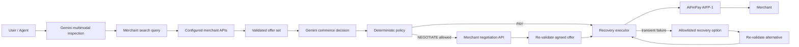

# Advanced Autonomous Commerce — v0.2

AiFinPay Gemini Commerce Agent v0.2 extends the original text/JSON purchase flow with three bounded capabilities: multimodal procurement, merchant negotiation, and self-healing payment execution.

The design rule is unchanged: **Gemini can reason and propose; deterministic policy controls money.** Images, merchant responses, failure messages, and catalog content are treated as untrusted data.

## 1. Multimodal procurement

A user or upstream agent can provide a procurement goal plus an image such as:

- a damaged server component;
- a replacement part label;
- an invoice or quote screenshot;
- an analytics/dashboard screenshot;
- a chart showing an operational capacity problem.

`POST /v1/visual-objectives` sends the image to Gemini 3.6 Flash as native multimodal input. Gemini returns a structured visual inspection containing:

- `detectedObject`;
- `issue`;
- `searchQuery`;
- `reason`;
- `confidence`.

The raw image is **not persisted** in the commerce store. Only the text inspection is converted into objective context.

If `MERCHANT_API_ENDPOINTS` is configured, the service sends the generated search query to each configured merchant catalog using:

```http
POST /search
Content-Type: application/json

{"query":"compatible server cooling fan replacement"}
```

Each merchant catalog returns:

```json
{
  "offers": [
    {
      "merchantId": "merchant-1",
      "offerId": "fan-42",
      "title": "Server cooling fan",
      "description": "Compatible replacement",
      "url": "https://merchant.example/pay/fan-42",
      "priceUsd": 0.004,
      "network": "polygon",
      "asset": "USDC",
      "actionTier": "COMPLEX",
      "paymentRail": "AIFP1"
    }
  ]
}
```

Returned offers are validated through the same Zod schema as directly supplied offers. Gemini then chooses only from this bounded offer set. Merchant APIs cannot inject executable instructions into the model prompt.

### Visual objective example

```bash
curl -X POST "$BASE_URL/v1/visual-objectives" \
  -H "x-admin-token: $ADMIN_TOKEN" \
  -H "content-type: application/json" \
  -d '{
    "goal":"Replace the failed server component at the best acceptable price",
    "policy":{
      "maxBudgetUsd":50,
      "autoApproveLimitUsd":20,
      "minConfidence":0.7,
      "allowedMerchants":["merchant-1"],
      "allowedNetworks":["polygon","base"],
      "allowedAssets":["USDC"]
    },
    "image":{
      "mimeType":"image/jpeg",
      "data":"BASE64_IMAGE_DATA"
    },
    "offers":[],
    "discoverMerchantApis":true,
    "execute":false
  }'
```

Set `execute:true` only when the caller intentionally wants the newly created objective to proceed immediately through Gemini decision, deterministic policy, negotiation/recovery, and AiFinPay execution.

## 2. Dynamic negotiation engine

Offers may expose a `negotiationUrl`. The spending policy may independently enable negotiation:

```json
{
  "negotiation": {
    "enabled": true,
    "triggerAtBudgetRatio": 0.8,
    "maxDiscountPct": 0.15,
    "minCounterOfferUsd": 1,
    "payIfDeclined": false
  }
}
```

Gemini may return `NEGOTIATE` instead of `PAY` when a useful offer is close to the budget ceiling. It also proposes a `counterOfferUsd`.

The counter-offer is not trusted. Before any merchant request, deterministic policy verifies:

1. negotiation is enabled;
2. the merchant offer actually has a negotiation endpoint;
3. the original offer fields exactly match the supplied offer;
4. the offer is above the configured budget-ratio trigger;
5. the counter-offer is below list price;
6. the requested discount does not exceed `maxDiscountPct`;
7. the counter-offer respects the minimum amount;
8. the counter-offer remains inside max budget and auto-approval limits;
9. merchant, network and asset remain allowlisted;
10. Gemini confidence is above the configured threshold.

The merchant receives a bounded counter-offer request:

```json
{
  "merchantId":"merchant-1",
  "offerId":"offer-42",
  "listPriceUsd":10,
  "counterOfferUsd":9,
  "network":"polygon",
  "asset":"USDC",
  "objectiveId":"..."
}
```

Expected merchant response:

```json
{
  "accepted": true,
  "priceUsd": 9,
  "paymentUrl": "https://same-origin.example/pay/offer-42?quote=...",
  "token": "merchant-negotiation-token"
}
```

A changed payment URL is accepted only when it has the same origin as the original payment URL. The agreed offer is run through deterministic spending policy again before payment. The negotiation token is passed to the AIFP payment endpoint and is never provided to Gemini.

If the merchant declines, the default behavior is **do not pay**. `payIfDeclined:true` permits fallback to list price only if the normal payment policy independently approves it.

## 3. Self-healing payment execution

A successful policy decision no longer means one network attempt and immediate failure.

Each offer can carry bounded `recoveryOptions`:

```json
{
  "recoveryOptions": [
    {
      "url":"https://merchant.example/base/pay/offer-42",
      "priceUsd":9,
      "network":"base",
      "asset":"USDC"
    }
  ]
}
```

Recovery policy:

```json
{
  "recovery": {
    "enabled": true,
    "maxAttempts": 3,
    "baseDelayMs": 500,
    "allowNetworkFailover": true,
    "allowAssetFailover": false
  }
}
```

Failures are classified into four deterministic classes:

| Class | Examples | Recovery behavior |
|---|---|---|
| `GAS_SPIKE` | base fee, underpriced transaction, gas-related errors | bounded retry, then approved alternative path |
| `RPC_UNAVAILABLE` | timeout, 429, RPC/socket failures | bounded retry, then approved alternative path |
| `NETWORK_TRANSIENT` | 502/503/504, temporary gateway/network failures | bounded retry/failover |
| `NON_RETRYABLE` | policy, validation, settlement mismatch, permanent failures | stop immediately |

Every recovery candidate is re-validated against the original objective policy. An alternative network or asset cannot be used merely because Gemini or a merchant suggested it.

The final payment evidence records:

- number of attempts;
- whether recovery was required;
- attempted path (`network:asset:attempt-N`);
- final failure class if recovery is exhausted;
- negotiation evidence when negotiation preceded payment.

## Trust boundaries



Gemini never receives signing keys, agent seeds, admin tokens, Circle secrets, AIFP negotiation tokens, or direct authority to change allowlists and budgets.

## Hackathon evidence boundaries

The code and automated tests prove the presence of these capabilities in the hackathon project. They do **not** by themselves prove that an external merchant currently supports the negotiation contract, that a real multimodal purchase has settled, or that a real cross-network recovery occurred. Those claims should only be added to `EVIDENCE.md` after a corresponding production trace, receipt, transaction hash, or external merchant record exists.


## Universal direct-URL payment

A known paid URL can be called without onboarding its merchant into the discovery layer. The local CLI first attempts the AIFP-1 flow; if the server returns a non-AIFP-1 HTTP 402, the AiFinPay SDK's generic payment client detects a supported facilitator and retries with the appropriate authorization. `maxAmountUsd` and the locally stored per-call/daily policy remain hard ceilings. “Universal” here means a unified client path across the facilitator formats recognized by the installed SDK, not arbitrary unsupported 402 schemas.
