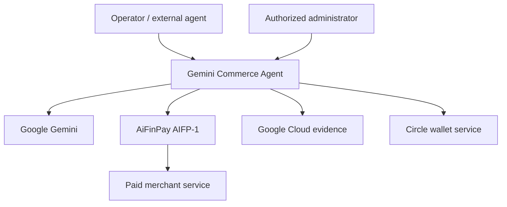
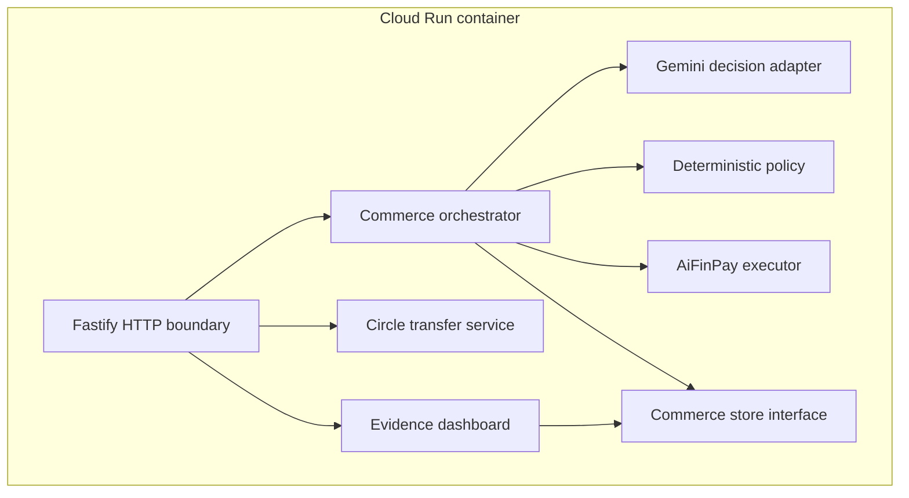
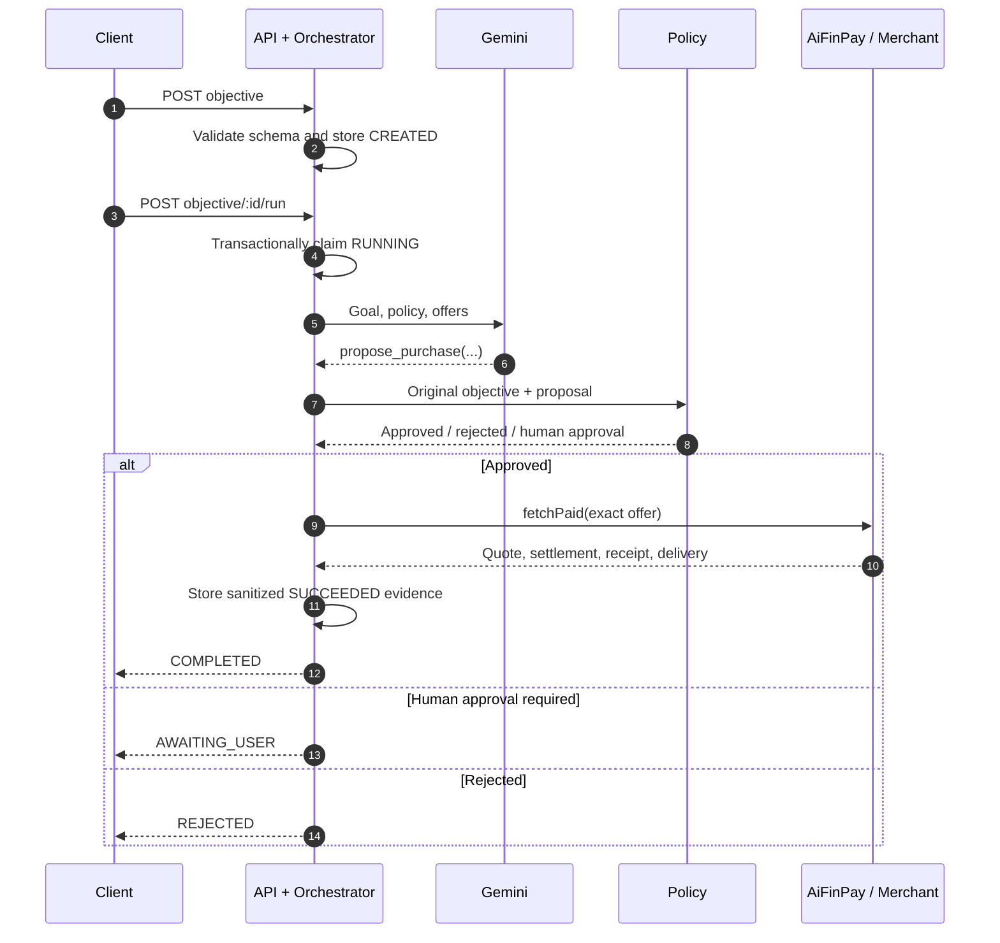
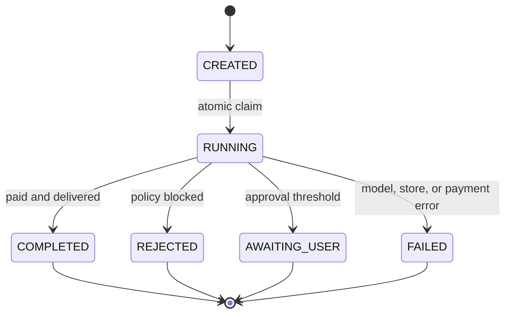
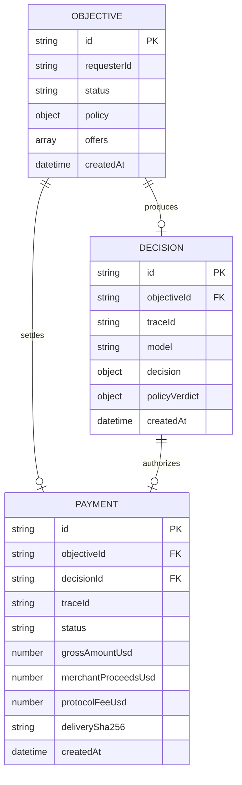
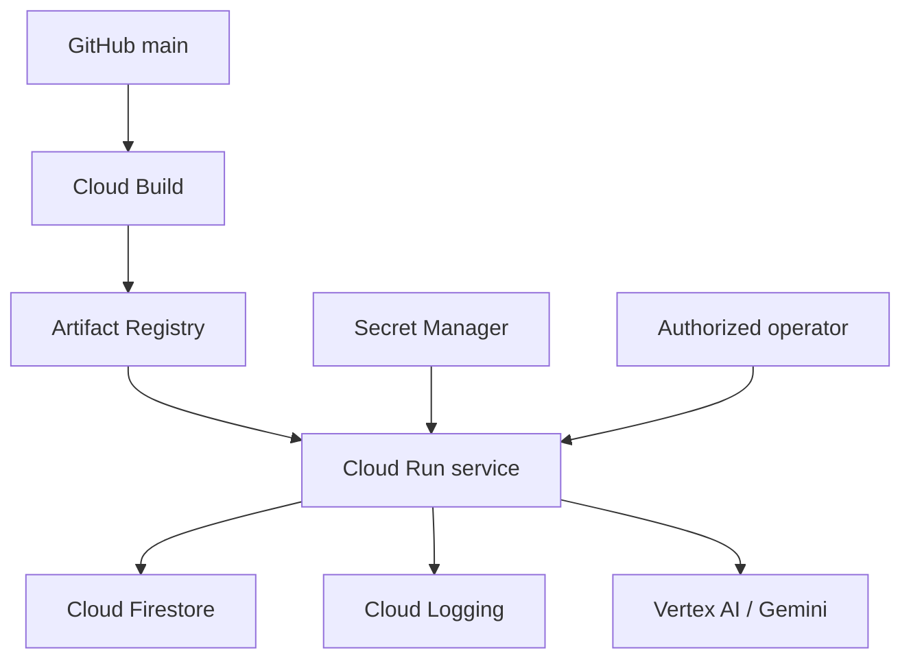

# Architecture

## 1. Scope

AiFinPay Gemini Commerce Agent adds an autonomous decision, policy, execution, and Google Cloud evidence layer to existing AiFinPay payment infrastructure. It does not replace AIFP-1, AIFP-2, AIFP-3, the Agent SDK, MCP server, settlement contracts, or network integrations.

The design follows one rule: **the model can propose a financial action but cannot authorize or sign it**.

## 2. Quality attributes

| Attribute | Design response |
|---|---|
| Financial safety | Exact deterministic validation after every model decision |
| Key isolation | Gemini has no signer, seed, API secret, or admin-token access |
| Idempotency | Transactional objective claim plus payment-rail replay protection |
| Auditability | Traceable objective, decision, policy verdict, payment, and delivery hash |
| Privacy | No receipt JWT, private key, entity secret, or delivered body in storage/logs |
| Availability | Stateless Cloud Run service with Firestore coordination |
| Testability | Dependency interfaces and in-memory adapters for deterministic tests |
| Portability | Containerized Node.js runtime with environment-based configuration |

## 3. System context

### External systems

| System | Data sent | Data received | Trust level |
|---|---|---|---|
| Gemini | Goal, policy summary, untrusted offer metadata | Structured purchase proposal | Untrusted financial proposer |
| AiFinPay | Exact approved merchant URL, scope, budget configuration | Quote, settlement result, receipt, paid response | Payment execution boundary |
| Merchant | Resource request and payment proof | HTTP 402 quote and paid content | Untrusted external service |
| Firestore | Objective, decision, verdict, sanitized payment evidence | Coordinated state and metrics | Trusted persistence |
| Cloud Logging | Redacted structured operational events | Searchable runtime evidence | Trusted observability |
| Circle | Explicit admin-approved transfer | Transaction ID/hash/status | Isolated optional payment path |

## 4. Container and component view

### Component responsibilities

| Component | Source | Responsibility | Must not do |
|---|---|---|---|
| HTTP boundary | `src/app.ts` | Authentication, parsing, routes, headers, redaction | Authorize a model-proposed payment |
| Domain schemas | `src/domain.ts` | Validate external inputs and define persisted records | Perform I/O |
| Orchestrator | `src/services/orchestrator.ts` | Own objective lifecycle and call components in order | Weaken policy verdicts |
| Gemini adapter | `src/services/gemini.ts` | Produce one typed decision through forced function calling | Access signers or execute payments |
| Policy engine | `src/services/policy.ts` | Compare proposal to original offer and policy | Trust model-generated prices |
| AiFinPay executor | `src/services/aifinpay.ts` | Execute exact approved AIFP-1 request | Select a different offer |
| Circle service | `src/services/circle.ts` | Create capped explicit USDC transfer | Receive instructions from Gemini |
| Store | `src/services/store.ts` | Coordinate states, decisions, payments and metrics | Store receipt bearer tokens |

## 5. Objective execution sequence

### Price integrity

The offer received by the API is the comparison anchor. Policy approval requires the Gemini proposal to match:

- `merchantId`
- `offerId`
- `priceUsd`
- `actionTier`
- `network`
- `asset`

The merchant, network, and asset must also appear in operator-defined allowlists. The amount must fit both total budget and auto-approval limit. Confidence must meet the configured threshold.

## 6. Objective state machine

Only `CREATED` is runnable. Firestore checks and changes the state inside one transaction. Concurrent requests cannot both claim the same objective.

## 7. Trust boundaries and controls

| Boundary | Threat | Enforcement | Failure behavior |
|---|---|---|---|
| Internet → API | Invalid or oversized input | Zod constraints, Fastify parsing, admin authentication | `400` or `403` |
| Merchant text → Gemini | Prompt injection | Treat descriptions as data; forced tool schema | No free-form financial execution |
| Gemini → policy | Price/destination mutation | Exact comparison with original offer | Reject |
| Policy → payment | TOCTOU or changed selection | Pass the matched original offer object | Abort if offer missing |
| Concurrent run → store | Duplicate payment | Firestore transactional claim | `409` not runnable |
| API → Circle | Unauthorized transfer | Admin token, literal confirmation, amount cap | `403` or validation failure |
| Runtime → logs | Secret leakage | Field redaction and evidence allowlist | Secret fields omitted |
| Merchant → storage | Sensitive delivered content | SHA-256 hash instead of body | Only digest persists |

## 8. Authentication and authorization

Financial write/read endpoints use `X-Admin-Token`. The comparison is constant-time after equal-length validation. The token must contain at least 24 characters.

Production configuration fails validation when financial credentials exist without an admin token. Secrets belong in Google Secret Manager and are exposed only to the Cloud Run service account.

Current administrative authentication is appropriate for a controlled hackathon deployment. A multi-tenant production service should replace it with identity-aware authentication, scoped service accounts, tenant authorization, token rotation, and per-principal audit records.

## 9. Data model

### Firestore collections

- `objectives`: immutable input plus controlled lifecycle state.
- `decisions`: Gemini output and deterministic policy verdict.
- `payments`: sanitized successful or failed execution evidence.

Receipt bearer JWTs, seeds, private keys, Circle entity secrets, admin tokens, and raw paid content are excluded from this model.

## 10. Google Cloud deployment

### Runtime properties

- Stateless container; Firestore holds coordinated state.
- Port supplied by `PORT`, default `8080`.
- JSON logs written to stdout and captured by Cloud Logging.
- Application Default Credentials in production.
- Minimum IAM grants to Gemini, Firestore, logging, and selected secrets.
- No credential files in the container image or repository.

See [DEPLOYMENT.md](DEPLOYMENT.md) for commands and configuration.

## 11. AIFP-1 execution

The executor creates a persistent AiFinPay agent from `AIFINPAY_AGENT_SEED_HEX`, applies daily and per-call budget limits, and calls `fetchPaid()` with the exact approved URL, scope, and one billing unit.

AIFP-1 performs:

1. request to the merchant resource;
2. HTTP 402 quote retrieval;
3. settlement using the configured agent wallet;
4. receipt exchange;
5. paid request retry;
6. delivery to the calling service.

The application records gross amount, 99% merchant proceeds, 1% protocol fee, transaction evidence when available, HTTP status, content type, and a delivery digest.

## 12. Circle isolation

Circle is intentionally outside the Gemini objective path. It exists for an optional verifiable Agentic Economy Prize transaction.

A transfer requires all of the following:

- configured Circle API key and entity secret;
- configured developer-controlled wallet ID and address;
- valid admin token;
- `confirm: true` literal in the request body;
- amount at or below `CIRCLE_MAX_TRANSFER_USD`;
- UUID idempotency key generated by the service.

Gemini cannot call this service through a tool and cannot access its credentials.

## 13. Observability and evidence

Every objective run has a `traceId`, `objectiveId`, and `decisionId`. Structured events record state transitions, policy code, payment status, transaction identifiers where safe, latency through platform logs, and error codes.

The metrics endpoint separates:

- objectives and decisions;
- approved and rejected decisions;
- successful and failed payments;
- gross payment volume;
- merchant revenue at 99%;
- AiFinPay protocol revenue at 1%;
- unique and paying requesters.

Only successful payment records contribute revenue. Screenshots and exports must be backed by source records listed in [EVIDENCE.md](EVIDENCE.md).

## 14. Failure strategy

| Failure | Objective result | Payment record |
|---|---|---|
| Gemini unavailable or invalid output | `FAILED` | None |
| Policy rejection | `REJECTED` | None |
| Human threshold exceeded | `AWAITING_USER` | None |
| AiFinPay execution error | `FAILED` | Sanitized `FAILED`, zero volume |
| Store error before payment | `FAILED` when state update succeeds | None |
| Duplicate run | No new transition | None |

Payment retries must rely on AIFP-1 idempotency and settlement replay protection. Blind application-level retries are not allowed for ambiguous financial outcomes.

## 15. Known limits and next controls

| Current limit | Production evolution |
|---|---|
| Single shared admin token | OIDC/IAP or workload identity with scoped principals |
| Firestore aggregate scans | Incremental counters or analytical export |
| No human-approval resume endpoint | Signed approval object and resumable state transition |
| One process-level config | Per-tenant encrypted policy and key isolation |
| Dashboard is public | Authenticated operations console with role-based access |
| Evidence records are mutable documents | Append-only audit stream and retention policy |

These limits are documented to prevent the hackathon implementation from being mistaken for a fully hardened multi-tenant financial platform.

## v0.2 advanced commerce layer

The core trust model now includes three optional capability stages before/around settlement:

1. `GeminiVisionEngine` converts image input into structured procurement facts; raw image bytes are not stored.
2. `MerchantDiscoveryService` queries only operator-configured merchant catalog endpoints and validates returned offers against the same offer schema.
3. `NegotiationService` and `executeWithRecovery` add bounded counter-offers plus transient-failure recovery. Every negotiated or recovery candidate is re-checked by deterministic spending policy before AiFinPay receives it.

The AI layer never receives signing credentials and cannot expand merchant/network/asset allowlists. See [ADVANCED_COMMERCE.md](ADVANCED_COMMERCE.md) for the complete contracts and threat boundaries.

## Per-user local wallet and universal x402

The public Render service is a hackathon runtime, not a custody surface for end users. `npx aifinpay-gemini-commerce-agent init` creates a distinct local seed for each operator, encrypts it at rest, and derives the agent's EVM/Solana/Casper identities locally. Direct URL execution uses AIFP-1 first to preserve receipt batching; an unresolved HTTP 402 then falls back to the installed SDK's generic facilitator detection (`Agent.pay`) with a deterministic maximum-amount cap. Merchant catalog integrations are optional sourcing inputs rather than a payment prerequisite.
