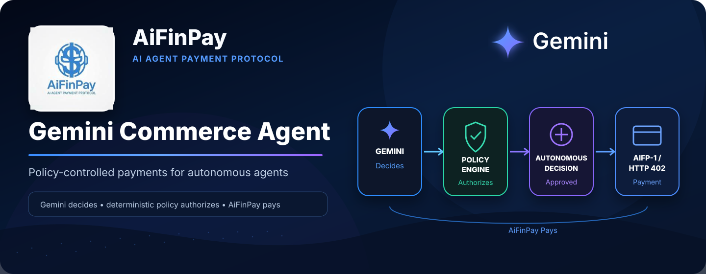
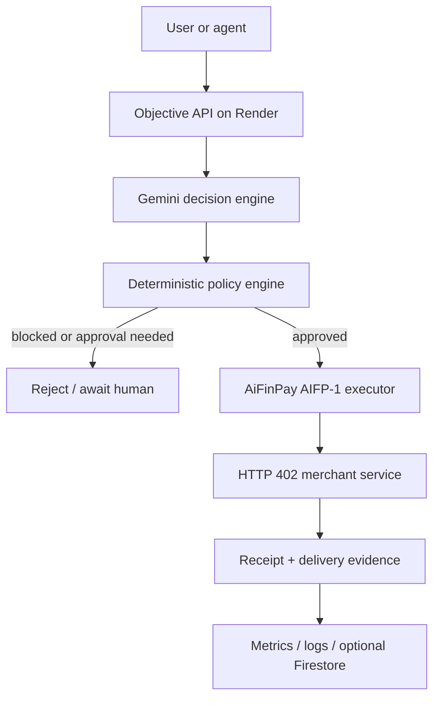
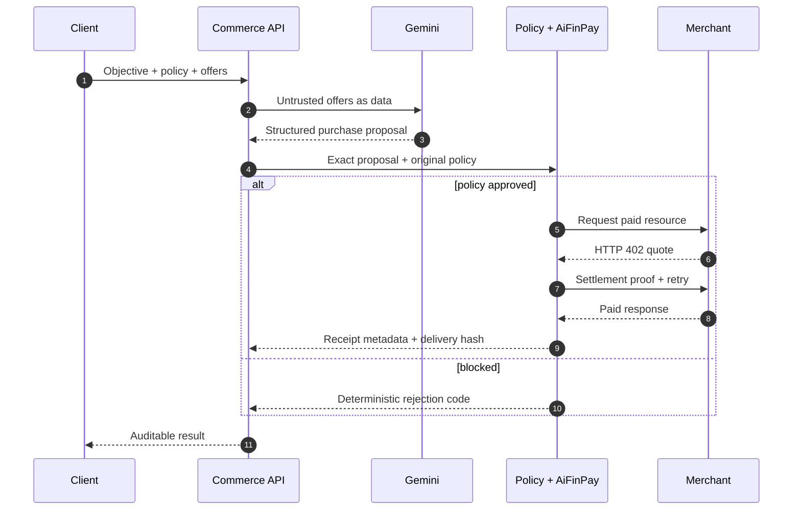

# AiFinPay Gemini Commerce Agent

<p align="center">
  
</p>

<p align="center">
  <a href="https://github.com/coinsecuritiescompany/AiFinPay-Gemini-Commerce-Agent/actions/workflows/ci.yml"></a>
  <a href="https://www.npmjs.com/package/@aifinpay/gemini-commerce-agent"></a>
  
  
  
  
</p>

<p align="center">
  <strong>Gemini decides. Deterministic policy authorizes. AiFinPay pays.</strong>
</p>

AiFinPay Gemini Commerce Agent is a policy-controlled commerce operator for autonomous software. It evaluates paid digital services with Gemini, independently enforces budgets and allowlists, executes AIFP-1 HTTP 402 payments, verifies delivery, and records auditable evidence.

Built for the **Build with Gemini XPRIZE** on top of disclosed, pre-existing AiFinPay payment infrastructure.

**Production:** https://aifinpay-gemini-commerce-agent.onrender.com

> [!NOTE]
> The public Render deployment and a real Gemini 3.6 Flash structured-function-call smoke test are verified. A funded AIFP-1 settlement, Circle transaction, third-party usage, and hackathon-period customer revenue are not claimed until verifiable records exist.

## Why this exists

Human checkout flows do not work for autonomous agents. An agent needs to understand an offer, choose whether it is useful, stay inside an operator-defined budget, pay without receiving signing keys, verify delivery, and leave an audit trail.

This service separates reasoning from financial authority:

| Layer | Responsibility | Financial authority |
|---|---|---|
| Gemini | Evaluate offers and propose one structured action | None |
| Policy engine | Verify price, merchant, asset, network, tier, confidence, and budget | Approve or block |
| AiFinPay executor | Perform the exact approved AIFP-1 HTTP 402 flow | Exact approved payment only |
| Circle service | Create an explicitly confirmed, capped USDC proof transfer | Admin-only isolated path |
| Store and logging | Persist state and non-secret evidence | None |

## System at a glance



Full component, sequence, deployment, trust-boundary, state, and data diagrams are in [ARCHITECTURE.md](ARCHITECTURE.md).

## Core guarantees

- Gemini never receives a private key, agent seed, Circle entity secret, or admin token.
- Every model proposal is checked against the original offer; Gemini cannot rewrite the price or payment destination.
- Merchant, network, asset, action tier, total budget, auto-approval limit, and confidence are enforced in deterministic TypeScript.
- Firestore can transactionally claim an objective when enabled, preventing the same objective from executing twice across instances.
- Receipt bearer tokens and delivered content are not persisted; the service stores hashes and settlement evidence.
- Production refuses to start with financial credentials unless a 24+ character admin token is configured.
- Circle transfers require admin authentication, `confirm: true`, and a hard maximum amount.

## Payment lifecycle



## Technology

| Area | Implementation |
|---|---|
| AI decision engine | Google Gemini 3.6 Flash via `@google/genai` and forced function calling |
| API | Node.js 22+, TypeScript, Fastify, Zod |
| Agent payments | `@aifinpay/agent`, AIFP-1, HTTP 402 |
| Optional prize proof | Circle Developer-Controlled Wallets |
| Persistence | In-memory production demo store; Google Cloud Firestore adapter available |
| Runtime | Render production web service |
| Evidence | Structured Render logs, metrics dashboard, optional Firestore |
| Delivery | GitHub Actions + Render |

## Install from npm

Run the packaged service directly:

```bash
npx @aifinpay/gemini-commerce-agent
```

Or install it into a Node.js project:

```bash
npm install @aifinpay/gemini-commerce-agent
```

The package exports the Fastify application builder for embedding:

```ts
import { buildApp } from "@aifinpay/gemini-commerce-agent";

const app = buildApp();
await app.listen({ port: 8080 });
```

Live Gemini calls require `GEMINI_API_KEY`. Production financial execution additionally requires an `ADMIN_TOKEN` and an AiFinPay agent seed; never commit these values.

## Repository map

```text
src/
├── app.ts                    HTTP boundary, authentication and security headers
├── config.ts                 validated environment configuration
├── domain.ts                 schemas and domain records
├── dashboard.ts              operational evidence dashboard
└── services/
    ├── gemini.ts             structured Gemini decision engine
    ├── policy.ts             deterministic financial policy
    ├── orchestrator.ts       objective state machine
    ├── aifinpay.ts           AIFP-1 payment execution
    ├── circle.ts             isolated USDC proof transfer
    └── store.ts              memory and Firestore adapters
tests/                        policy, security and API tests
.github/                      CI and deployment workflows
```

## Run from source

### Prerequisites

- Node.js 22+
- npm 10+
- Gemini API access for live model calls
- funded AiFinPay settlement wallet for live payments
- optional Google Cloud Firestore and Circle Developer-Controlled Wallet credentials

```bash
git clone https://github.com/coinsecuritiescompany/AiFinPay-Gemini-Commerce-Agent.git
cd AiFinPay-Gemini-Commerce-Agent
cp .env.example .env
npm ci
npm run dev
```

The service can start without financial credentials for local inspection. Open `http://localhost:8080` for the evidence dashboard.

### Validate

```bash
npm run check
npm run build
npm audit
npm pack --dry-run
```

The current suite contains 13 tests covering policy enforcement, configuration safety, protected financial routes, revenue accounting, and the successful objective flow.

## Minimal objective example

```bash
curl -sS http://localhost:8080/v1/objectives \
  -H 'content-type: application/json' \
  -H "x-admin-token: $ADMIN_TOKEN" \
  -d '{
    "goal": "Buy one complex research API result",
    "requesterId": "external-user-001",
    "policy": {
      "maxBudgetUsd": 0.01,
      "autoApproveLimitUsd": 0.005,
      "minConfidence": 0.6,
      "allowedMerchants": ["merchant-id-from-aifp1"],
      "allowedNetworks": ["polygon"],
      "allowedAssets": ["USDC"]
    },
    "offers": [{
      "merchantId": "merchant-id-from-aifp1",
      "offerId": "research-complex-001",
      "title": "Research API",
      "description": "One complex research request",
      "url": "https://gateway.aifinpay.io/merchant-slug/research",
      "priceUsd": 0.002,
      "network": "polygon",
      "asset": "USDC",
      "actionTier": "COMPLEX",
      "paymentRail": "AIFP1"
    }]
  }'
```

Run the returned objective ID:

```bash
curl -sS -X POST http://localhost:8080/v1/objectives/OBJECTIVE_ID/run \
  -H "x-admin-token: $ADMIN_TOKEN"
```

## API surface

| Method | Route | Authentication | Purpose |
|---|---|---|---|
| `GET` | `/` | Public | Evidence dashboard |
| `GET` | `/health` | Public | Runtime and integration status |
| `GET` | `/v1/metrics` | Public | Aggregate non-secret metrics |
| `GET` | `/v1/aifinpay/status` | Public | Public agent addresses, funding recommendation and safe balance snapshot |
| `POST` | `/v1/objectives` | Admin token | Create objective |
| `GET` | `/v1/objectives/:id` | Admin token | Read objective state |
| `POST` | `/v1/objectives/:id/run` | Admin token | Execute Gemini → policy → payment |
| `GET` | `/v1/circle/status` | Public | Circle configuration status |
| `POST` | `/v1/circle/transfers` | Admin token | Explicit capped USDC transfer |

## Economics recorded by the service

| Action tier | Price per action |
|---|---:|
| Standard | `$0.0005` |
| Complex | `$0.002` |
| Premium | `$0.005` |

Successful AIFP-1 transactions record 99% merchant proceeds and a fixed 1% AiFinPay protocol fee. Failed or blocked actions add zero payment volume. The policy engine rejects any model-generated price mutation.

## Documentation

| Document | Purpose |
|---|---|
| [Architecture](ARCHITECTURE.md) | Components, trust boundaries, flows, state, deployment and data model |
| [Render deployment](RENDER_DEPLOYMENT.md) | Production Render runtime configuration |
| [Deployment](DEPLOYMENT.md) | Optional Google Cloud, Firestore, Cloud Run and Secret Manager setup |
| [Security](SECURITY.md) | Supported version, threat controls and private reporting |
| [Evidence](EVIDENCE.md) | Hackathon logs, screenshots, transactions and P&L checklist |
| [Hackathon disclosure](HACKATHON_DISCLOSURE.md) | New work versus pre-existing AiFinPay resources |
| [Contributing](CONTRIBUTING.md) | Contribution rules and developer workflow |
| [Trademark policy](TRADEMARKS.md) | Permitted and prohibited brand use |

## License and brand

Copyright © 2026 AiFinPay and its respective copyright holders. All rights reserved.

The repository and npm package are **source-available, not open source**. The [AiFinPay Source-Available License 1.0](LICENSE) permits review, local evaluation, security research, and hackathon judging. It does not permit production or commercial use, resale, redistribution, public derivative products, competing services, model training on the repository, or use of AiFinPay branding without written permission.

Third-party packages remain subject to their own licenses. See [NOTICE](NOTICE) and [TRADEMARKS.md](TRADEMARKS.md).

## Links

- Product: [aifinpay.io](https://aifinpay.io)
- Production demo: [aifinpay-gemini-commerce-agent.onrender.com](https://aifinpay-gemini-commerce-agent.onrender.com)
- AIFP-1 protocol: [AiFinPay/Protocol-AIFP-1](https://github.com/AiFinPay/Protocol-AIFP-1)
- Gemini Commerce Agent: [`@aifinpay/gemini-commerce-agent`](https://www.npmjs.com/package/@aifinpay/gemini-commerce-agent)
- Agent SDK: [`@aifinpay/agent`](https://www.npmjs.com/package/@aifinpay/agent)
- MCP server: [`@aifinpay/mcp`](https://www.npmjs.com/package/@aifinpay/mcp)
