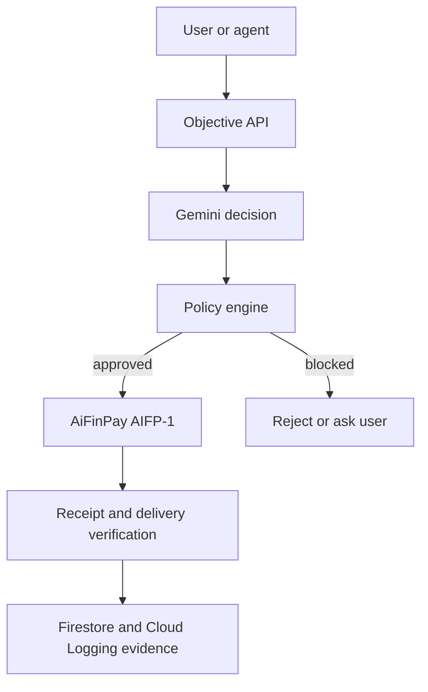

# AiFinPay Gemini Commerce Agent

AiFinPay Gemini Commerce Agent is an AI-native commerce operator built for the **Build with Gemini XPRIZE**. Gemini evaluates paid digital services, while deterministic code enforces budgets and allowlists before AiFinPay executes an HTTP 402 payment.

The project is a new hackathon application built on top of disclosed pre-existing AiFinPay infrastructure.

## What it does

1. Accepts a goal, spending policy and merchant offers.
2. Calls Gemini through Google Cloud with forced function calling.
3. Validates the proposed purchase independently of the model.
4. Executes a real AIFP-1 payment with `@aifinpay/agent`.
5. Verifies the paid response and stores only non-secret evidence.
6. Exposes production metrics for Devpost evidence.
7. Supports a separately protected Circle Developer-Controlled Wallet USDC transfer for the Agentic Economy Prize.

## Safety model

Gemini never receives or controls a private key. It proposes one structured decision. The policy engine checks the exact merchant, offer, tier, amount, network, asset, budget, auto-approval limit and confidence threshold. Only deterministic code can call the payment adapter.

Circle transfers require:

- a configured developer-controlled wallet;
- an `X-Admin-Token` header;
- `confirm: true` in the request;
- an amount below `CIRCLE_MAX_TRANSFER_USD`.

## Architecture



See [ARCHITECTURE.md](ARCHITECTURE.md) for the full trust boundaries and records.

## Requirements

- Node.js 22+
- a Google Cloud project with Gemini access
- Application Default Credentials in production, or `GOOGLE_API_KEY` for local development
- a persistent AiFinPay agent seed with funded settlement wallet for real payments
- optional Circle Developer-Controlled Wallet credentials for the prize proof

## Local setup

```bash
cp .env.example .env
npm install
npm run dev
```

The service starts without financial credentials, but `/v1/objectives/:id/run` cannot complete a production Gemini/payment flow until the corresponding services are configured.

Open `http://localhost:8080` for the evidence dashboard.

## Create and run an objective

```bash
curl -sS http://localhost:8080/v1/objectives \
  -H 'content-type: application/json' \
  -H "x-admin-token: $ADMIN_TOKEN" \
  -d '{
    "goal": "Buy one complex research API result",
    "requesterId": "external-user-001",
    "policy": {
      "maxBudgetUsd": 0.01,
      "autoApproveLimitUsd": 0.005,
      "minConfidence": 0.6,
      "allowedMerchants": ["merchant-id-from-aifp1"],
      "allowedNetworks": ["polygon"],
      "allowedAssets": ["USDC"]
    },
    "offers": [{
      "merchantId": "merchant-id-from-aifp1",
      "offerId": "research-complex-001",
      "title": "Research API",
      "description": "One complex research request",
      "url": "https://gateway.aifinpay.io/merchant-slug/research",
      "priceUsd": 0.002,
      "network": "polygon",
      "asset": "USDC",
      "actionTier": "COMPLEX",
      "paymentRail": "AIFP1"
    }]
  }'
```

Copy the returned `id`, then run:

```bash
curl -sS -X POST http://localhost:8080/v1/objectives/OBJECTIVE_ID/run \
  -H "x-admin-token: $ADMIN_TOKEN"
```

## Circle proof transfer

This endpoint moves real USDC when production credentials are configured.

```bash
curl -sS -X POST http://localhost:8080/v1/circle/transfers \
  -H 'content-type: application/json' \
  -H "x-admin-token: $ADMIN_TOKEN" \
  -d '{
    "destinationAddress": "RECIPIENT_ADDRESS",
    "amountUsd": 0.01,
    "confirm": true
  }'
```

The response contains the Circle transaction ID and, after Circle reports it, the transaction hash and explorer URL.

## API

| Method | Route | Purpose |
|---|---|---|
| `GET` | `/health` | Configuration and runtime status |
| `GET` | `/` | Evidence dashboard |
| `POST` | `/v1/objectives` | Create an objective; admin token required |
| `GET` | `/v1/objectives/:id` | Read objective state; admin token required |
| `POST` | `/v1/objectives/:id/run` | Execute Gemini → policy → payment; admin token required |
| `GET` | `/v1/metrics` | Aggregate evidence metrics |
| `GET` | `/v1/circle/status` | Public Circle configuration status |
| `POST` | `/v1/circle/transfers` | Protected real USDC transfer |

## Validation

```bash
npm run check
npm run build
```

The test suite proves that:

- exact policy-compatible decisions execute;
- altered prices are blocked;
- merchants outside the allowlist are blocked;
- high-cost or low-confidence decisions require approval;
- Circle transfers cannot be triggered without the admin token;
- protocol revenue is recorded separately from gross payment volume.

## Deployment and evidence

- [DEPLOYMENT.md](DEPLOYMENT.md) — Google Cloud and Cloud Run
- [EVIDENCE.md](EVIDENCE.md) — invoices, logs, screenshots, transactions and P&L checklist
- [HACKATHON_DISCLOSURE.md](HACKATHON_DISCLOSURE.md) — new work versus pre-existing resources
- [SECURITY.md](SECURITY.md) — secrets, logging and incident handling

## Pricing recorded by the application

- Standard: `$0.0005`
- Complex: `$0.002`
- Premium: `$0.005`
- AiFinPay protocol fee: `1%` of a successful AIFP-1 transaction
- Merchant proceeds: `99%`

These values must match the live merchant quote and receipt. The policy engine refuses model-generated price changes.

## License

MIT — see [LICENSE](LICENSE).
